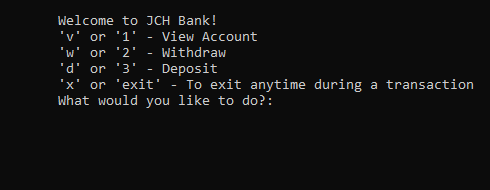
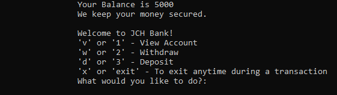

# Console Application ATM Machine

## Lab 02 - Unit Testing

*Author: Joseph Hangarter*

----

## Description
Basic ATM machine where a user can deposit, withdraw, or view account.
* To view balance - press '1'
* To withdraw - press '2'
* To depost - press '3'

---

### Getting Started
Clone this repository to your local machine.

```
$ git clone [https://github.com/JCode1986/Lab-02-ATM-Machine.git]
```

### To run the program from Visual Studio:
Select ```File``` -> ```Open``` -> ```Project/Solution```

Next navigate to the location you cloned the Repository.

Double click on the ```ATM-Machine``` directory.

Then select and open ```ATM-Machine.sln```


### Visuals
***[Add screenshots of your application in action]***

#### Application Start

#### Using the Application

